# Weather Data Analysis: What's the weather like as we approach the equator?

Author: Rosie Gianan, gianr00@gmail.com

Build With: Python, Python API’s, JSON, Pandas, Numpy, Matplotlib, API Requests 

## Goals:
1.    Visualize the weather of 500+ cities of varying distance from the equator using [simple Python library](https://pypi.python.org/pypi/citipy) and the [OpenWeatherMap API](https://openweathermap.org/api).  Create the representative model of weather across cities.
2.    Visualize the weather data to help plan for future vacations using Jupyter-gmaps and the Google Places API.

## Solutions:
1.    Build a visualization and plotting scripts for the 500 + cities of varying distance from the equator.
-    Create a random list of cities of varying distance from the equator and retrieves the weather data from OpenWeatherMap API for each city
-    Saves the city data into a dataframe and exports them into csv file.
-    Visualizes the weather of the list of cities using scatter plots and linear regression

Visualization Plots:

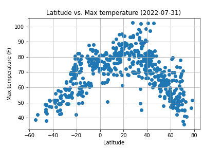 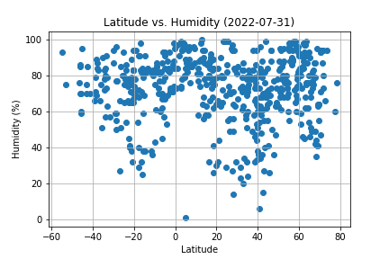

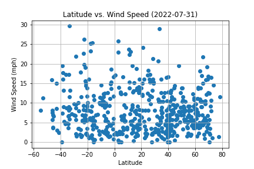
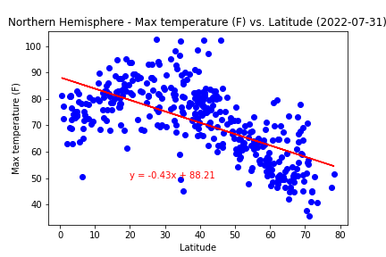
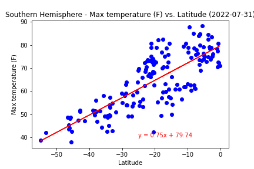
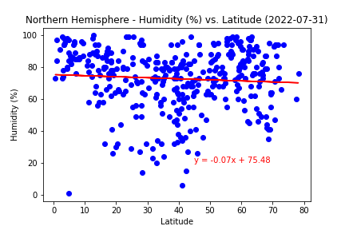
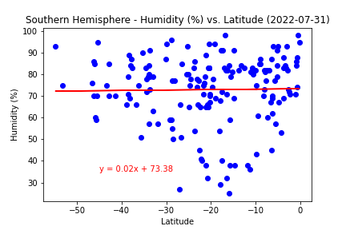
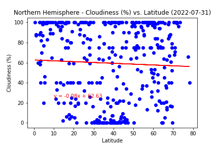
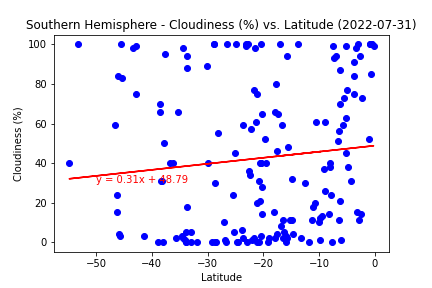
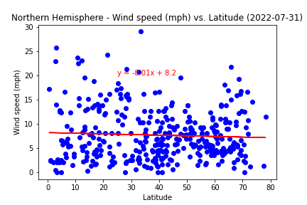
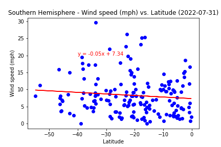
