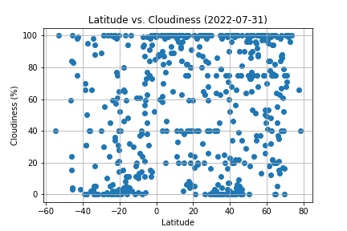

# Weather Data Analysis: What's the weather like as we approach the equator?

Author: Rosie Gianan, gianr00@gmail.com

Build With: Python, Python API’s, JSON, Pandas, Numpy, Matplotlib, API Requests 

## Goals:
1.    Visualize the weather of 500+ cities of varying distance from the equator using [simple Python library](https://pypi.python.org/pypi/citipy) and the [OpenWeatherMap API](https://openweathermap.org/api).  Create the representative model of weather across cities.
2.    Visualize the weather data to help plan for future vacations using Jupyter-gmaps and the Google Places API.

## Solutions:
1.    Build a visualization and plotting scripts for the 500 + cities of varying distance from the equator.
-    Create a random list of cities of varying distance from the equator and retrieves the weather data from OpenWeatherMap API for each city
-    Saves the city data into a dataframe and exports them into csv file.
-    Visualizes the weather of the list of cities using scatter plots and linear regression

Visualization Plots:

 
 
 
 
 
 

## Observable Trends from analysis results:
-   Based on the data collected for the cities used in this analysis, it is showing that there is a correlation between the latitude and max temperature for cities in northern and southern hemisphere. The data shows a negative linear regression in the cities located in northern hemisphere and positive linear regression in the cities located in southern hemisphere. Both linear regressions indicate the farther the location of the city from the equator (0 latitude), the temperature goes down thus indicating the cities that are farther from the equator has colder temperature.
-   The data points between the humidity vs latitude for cities in northern and southern hemisphere are spread out thus indicating that the city’s distance from the equator doesn’t influence the humidity. Similar trends are also showing in the analysis result for cloudiness vs latitude and wind speed vs latitude.
-   The number of cities used in this analysis are not equally distributed between the cities in northern vs southern hemisphere. The are more cities located in northern hemisphere compared to the cities located in southern hemisphere. With uneven cities distributions used in this analysis, the result is showing that this distribution doesn’t influence the obvious trend that the farther the city from the equator the colder the temperature is. It is also showing that the location and distance of the city from the equator doesn’t impact the humidity, cloudiness and wind speed.
